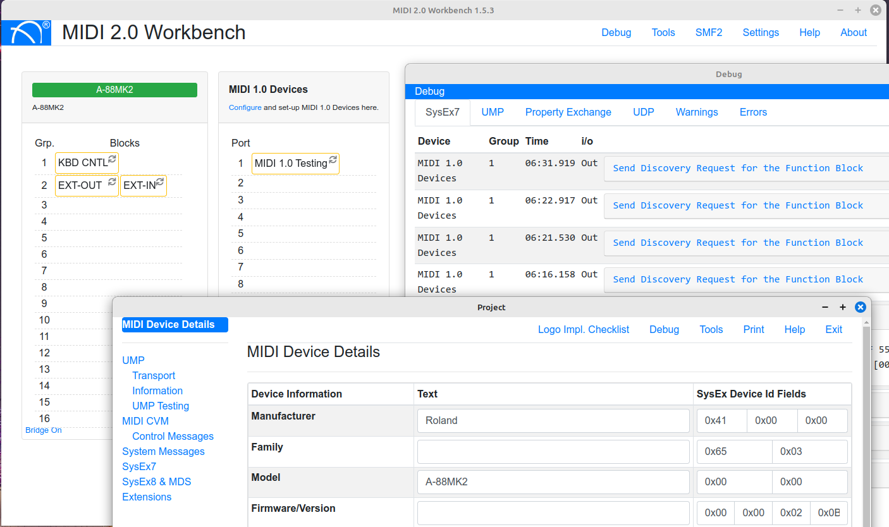

# MIDI 2.0 Workbench


The MIDI 2.0 Workbench is a free tool from MIDI Association Members to help developers develop, debug (and deploy) MIDI 2.0 Applications and Devices. It runs on Windows, Mac and Linux.
The Workbench connects to your device or software, to test various MIDI 2.0 implementation features against the currently released specifications.

It provides a comprehensive debug of: 
* UMP messages
  * Stream Messages
  * Channel Voice Messages
  * System
  * Utility
  * SysEx
* MIDI-CI v1.1 and 1.2
  * Discovery
  * Property Exchange
  * Profiles
  * Process Inquiry
  * Protocol Negotiation (1.1. only)
* Standard MIDI File 2 - Processor and validator

The MIDI 2.0 Workbench also test various UMP transports where possible.
To test USB MIDI 2.0 please make sure you use either:
* OSX 14+
* Linux with a 6.5+ Kernel and ALSA libs 1.2.10+
Some prior version may work with mixed results.

There are many features as part of the Workbench this includes:
* Logo Licence Checklist generator
* Extensive Property Exchange Interface testing including Subscriptions
* Function Block and USB Group Terminal Block display and reporting
* UMP Generator
* Bridging UMP Devices

### How To Build this Project
-----------------------
Use version 16.x of NodeJS. Later versions have issues with the C++ plugins.

After you cloned this repository
please run:
```
yarn
yarn run build
```
To run the application:
```
yarn run start
```


#### Issues and Updates
-----------------
This Project aims to follow the current public MIDI specifications. 
Please use the GitHub Issues to log any bugs, suggestions etc. 

This project is supported and copyrighted by Yamaha Corporation 2020 under MIT. 
