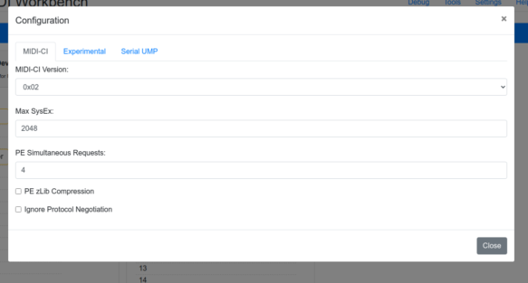

# MIDI 2.0 Workbench Settings
The MIDI 2.0 Workbench Settings modal can be opened on the [[Initial Screen|index]] using the **Settings** link.

### MIDI-CI
**MIDI-CI Version** is the ability for the Workbench to use different version of MIDI-CI. MIDI-CI 1.2 (under 
development) presents a method for MIDI-CI Devices with different versions to work together.
A Device under test _should_ test with the MIDI 2.0 Workbench using both options. 

**Max SysEx** is the value sent by the Workbench on MIDI-CI Discovery to a remote Device.

**PE Simultaneous Requests** is used by Property Exchange to declare how many Request Id's can be used at one time 
by a remote Device.

**PE zLib Compression** if the MIDI 2.0 Workbench should support zLib Compression on PE Requests if available.

**Ignore MIDI-CI Protocol Negotiation** if the MIDI 2.0 Workbench should ignore Protocol Negotiation. This is to help those 
Devices that have issues with handling Protocol Negotiation and need to bypass this option temporarily. 

---
### Experimental

**Debug/Log Active Sense and Clock Messages** Currently the MIDI 2.0 Workbench suppresses Timing Clock (0xF8) and Active 
Sense (0xFE) messages in the [[Debud|debug]]. This allows these Messages to be displayed.

**SysEx Time between SysEx Messages** is used to indicate an artificial milli-second delay between each SysEx Messages 
sent from the Workbench. This should be used troubleshooting purposes only and generally should be left at 1ms.

