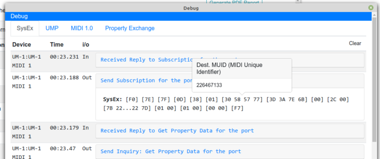
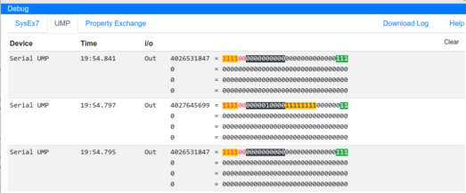
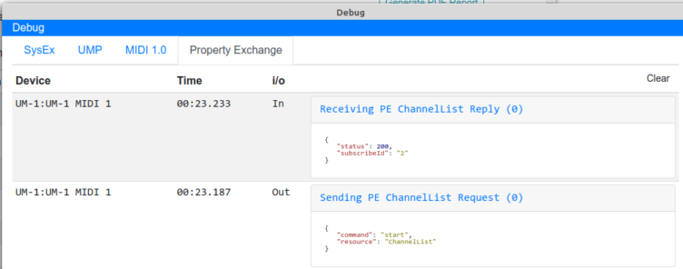

# Debug Window
The Debug Window can be opened on the _**Debug**_ link on the Initial window and on the Project windows.
The Debug Window can also be opened anytime by using CTRL-d.

The Debug Window allows to view a breakdown of the following messages as they occur:
* [SysEx7](#sysex7)
* [UMP](#ump)
* [Property Exchange](#property-exchange-tab)
* Download Log

The Download Log creates a file of the current Session. This is used for debugging purposes. 
Please attach this log when [[reporting|report]] errors.

The logs in each tab can be cleared at anytime using the _**Clear**_ button on each tab. 

---
## SysEx7 Tab

The System Exclusive 7 tab shows the complete SysEx 7 message. By clicking on each message you can see a breakdown of 
the various parts that make up the message and its value by hovering over the message parts.

All raw MIDI-CI messages are viewable here. Sysex7 messages that arrive using UMP will also show here.

---
## UMP Tab

The UMP tab logs incoming UMP Data (except SysEx) from Devices. By clicking on each message you can see a breakdown of
the various parts that make up the message and its value by hovering over the message parts.

---
## Property Exchange Tab

Display incoming and outgoing Property Exchange JSON Messages. This will also highlight ant issues with the JSON Data 
being sent.

