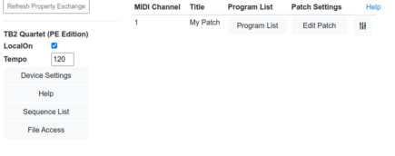
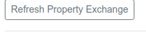
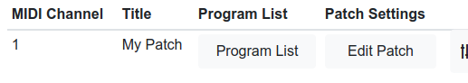
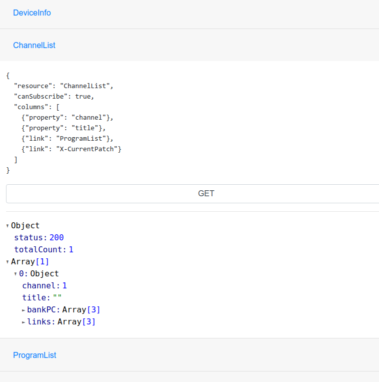

# Property Exchange User Testing

Property Exchange Testing is made up of two parts
* [User Testing](#user-testing)
* [Raw Testing](#raw-testing)

Property Exchange in the Workbench will attempt to use subscriptions where possible. It will automatically update values
when Subscriptions are received.

---
## User Testing
User Testing Presents a stylised view of a Property Exchange MIDI-CI Device:

This screen is broken down into different sections:

1. **Property Exchange Refresh button** - This will refresh the PE Details and will rebuild the screen based on the 
ResourceList, DeviceInfo, ChannelList Resources.

2. **DeviceInfo Resource** and other Device details. 

Links will display based on what type of Resource it is. For example in the above screenshot the Tempo Resource is a 
Simple Property Resource of type number and is displayed as a number field. 
"Device Settings" is a JSON Object with many fields. It is shown as a button that can be clicked to open an editor.

3. **ChannelList Resource Display** - Shows the Channel set-up provided by the ChannelList Resource.

The Structure of the ChannelList is detemined by the ResourceList Settings

---
## Raw Testing

Raw Testing allows you to directly send Property Exchange Data to the Device and the see the result. Click the Resource 
name to see the Get or Set options. Raw Testing is built based on the ResourceList Property Data.

