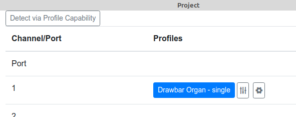

# Profile Configuration User Testing

If the Devices supports Profiles and it has reported those Profiles to the Workbench a screen similar to this will display:

From this screen you can re-retrieve the list of Profiles by using the **Detect via Profile Inquiry Message** button.

Each Profile supported by the Device will show in the list below. Profiles highlighted in blue are Enabled.
Channel Profiles will also show a  Slider Icon. Clicking this Icon will show a list of Channel 
Voice Message Controllers for this Profile. 

Profile may also have a  Cog Icon to signify a custom Profile window is available. 

