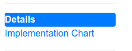
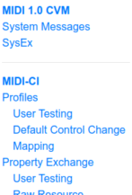
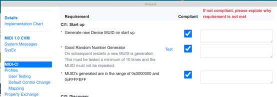
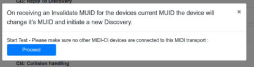
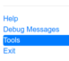

# Project Screen
The MIDI 2.0 Workbench is a interoperability and testing tool, primarily meant for testing MIDI 2.0 Devices. The testing checklists 
and testing tools are all found in the left sidebar menu.

The Menu is made up of three sections:
* [General Device Information](#general-device-information)
* [Checklists and User Testing](#checklists-and-user-testing)
* [Debug, Tools and Exit](#debug-and-tools)

Please read each section carefully to understand how each part reacts and works together.

_note: It is import to complete The General Device Information before completing the Checklists and User Testing, as 
the General Device information determines which Checklists and User Testing are required. MIDI-CI Discovery will 
attempt to self configure these options where possible,_

---
## General Device Information

### Details Tab
The Details Tab provides a form for gathering information about the Product. Filling out the form will determine which
unit tests should be added to the sidebar. Information such as the SysEx Id's are used for testing.

Please take note of the **Device Type** field. The checkboxes for Controller and Tone Generator are import to fill.

#### Generate PDF Report
By pressing this button, located in the top-right of the Details Page, the Workbench will create a Report of the 
Checklists and User Tests.

### Implementation Chart
The implementation Chart builds upon the data in the Details Tab. It represents the current MIDI Implementation Charts 
found in many products. Like Details page it is important fill out the details. For example by adding that the Device 
supports Universal System Exclusive Device Inquiry the checklists under SysEx will now provide tests for this function.

---
## Checklists and User Testing

This part of the Sidebar allows for the testing of the Product, the Sidebar links will depend on what elements the Product
supports. Click on each Sidebar link to display a new tab.

Most links will provide a checklist:

While links labelled User Testing (and Raw Testing) will provide entry points to test [[Protocol Negotiation|protocol]], 
[[Profile Configuration|profiles]] and [[Property Exchange|pe]].

A Checklist Requirement will sometimes contain a **Test** Button. Clicking on the Test button will present a series of 
steps to test the connected Device.

---
## Debug and Tools 

The Debug, Tools and Testing Sidebar menu options provide a useful tools while using the Workbench
* **Help** opens this help page
* **Debug** open the [[Debug Window|debug]]
* **Tools** provides a set of helpful tools
* **Exit** returns to the [[Intial Screen|index]]

